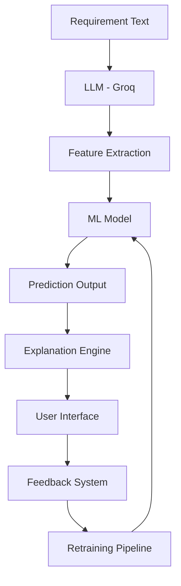
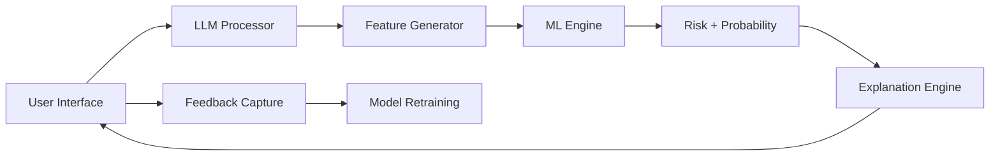
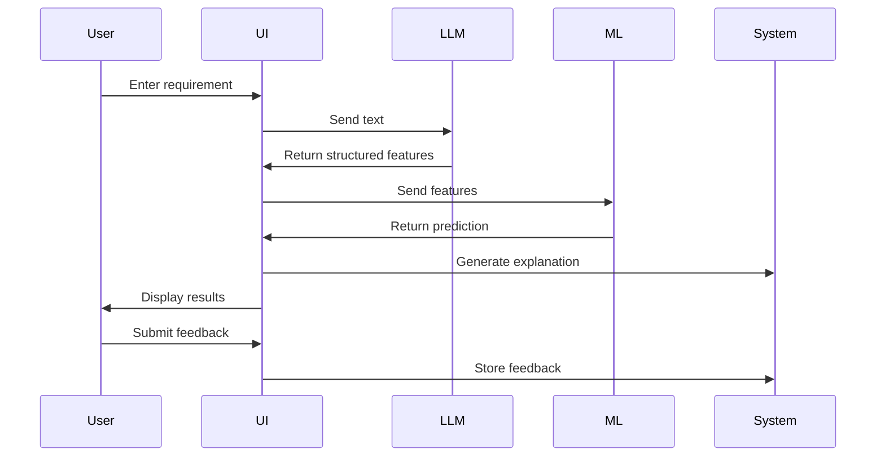
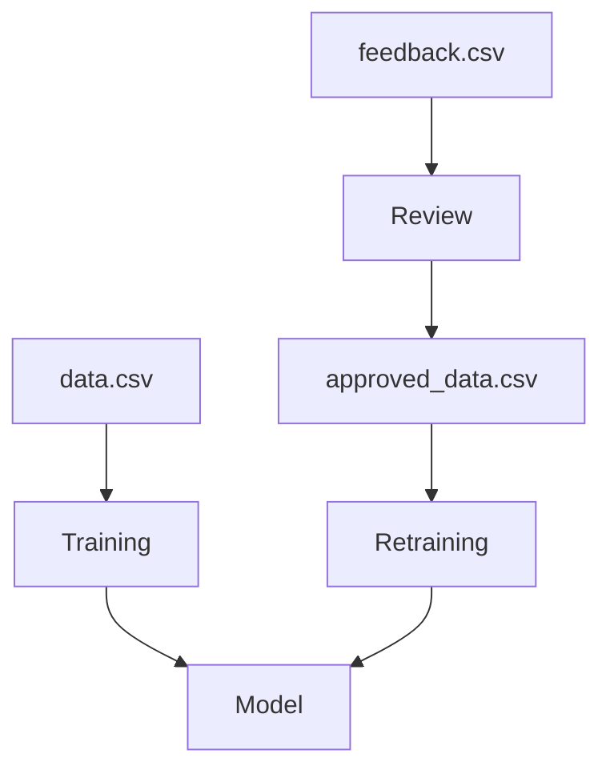
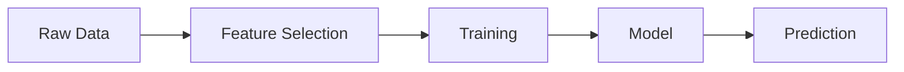
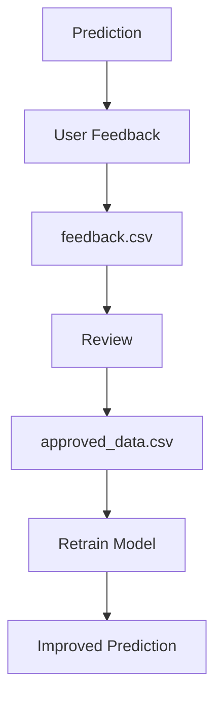

# ⚠️ AI Requirement Risk Predictor – Full System Design

----------

# 📌 1. Full Picture

## 1.1 Why this is needed

### (a) Context

Software delivery often suffers from delays due to:

-   unclear requirements
    
-   hidden dependencies
    
-   cross-team coordination
    
-   unrealistic deadlines
    

These risks are usually discovered **too late**.

----------

### (b) Big Picture

We move from:

❌ Reactive delivery → fix after failure  
➡️  
✅ Proactive delivery → predict and prevent early

----------

### (c) Problem Statement

We need a system that can:

-   understand requirement text
    
-   convert it into structured signals
    
-   predict delivery risk
    
-   explain _why_ the risk exists
    

----------

## 1.2 What success looks like

### (a) Desired Outcome

-   Early risk prediction
    
-   Actionable insights
    
-   Consistent and explainable output
    

----------

### (b) Success Metrics

-   Risk prediction accuracy
    
-   Spillover prediction error
    
-   Reduction in delivery delays
    
-   User adoption rate
    

----------

## 1.3 How we plan to achieve it

### (a) Approach

Combine:

-   LLM → understanding
    
-   ML → prediction
    
-   Rules → explanation
    
-   Feedback → continuous improvement
    

----------

# 🧠 2. High-Level Architecture

----------

# 🧩 3. Functional Block Diagram

----------

# 🔄 4. End-to-End Sequence Flow

----------

# 📊 5. Data Flow Diagram

----------

# ⚙️ 6. Technical Architecture

## Tech Stack

Layer

Technology

UI

Streamlit

LLM

Groq

ML

Scikit-learn

Data

CSV

Storage

Local

----------

# 🧠 7. ML Pipeline

----------

## Models Used

-   RandomForestClassifier → Risk
    
-   RandomForestRegressor → Probability
    

----------

## Why Random Forest

-   works well on tabular data
    
-   stable
    
-   no heavy tuning
    
-   handles non-linearity
    

----------

# 🔍 8. Feature Engineering

Features extracted:

-   story_points
    
-   dependencies
    
-   teams_involved
    
-   team_experience
    
-   complexity
    
-   deadline_days
    
-   external_integrations
    
-   production_impact
    
-   requirement_clarity
    
-   test_scope
    
-   past_delay_rate
    

----------

# 🧠 9. Explanation Engine

Each prediction includes:

### Factor

Example: High dependencies

### Rationale

More systems involved

### Principle

More dependencies → more coordination risk

----------

# 🔄 10. Feedback Loop

----------

# 🧩 11. System Components

Component

Role

LLM

Text understanding

ML

Prediction

Rules

Explanation

Feedback

Learning

UI

Interaction

----------

# ⚠️ 12. Limitations

-   synthetic training data
    
-   LLM variability
    
-   requires feedback for improvement
    

----------

# 🚀 13. Future Enhancements

-   persistent model storage
    
-   automated retraining
    
-   dashboards
    
-   Jira integration
    
-   feature importance charts
    

----------

# 🎯 14. Summary

System converts:

Requirement → Features → Prediction → Explanation → Feedback → Learning

----------

# 🏁 End
